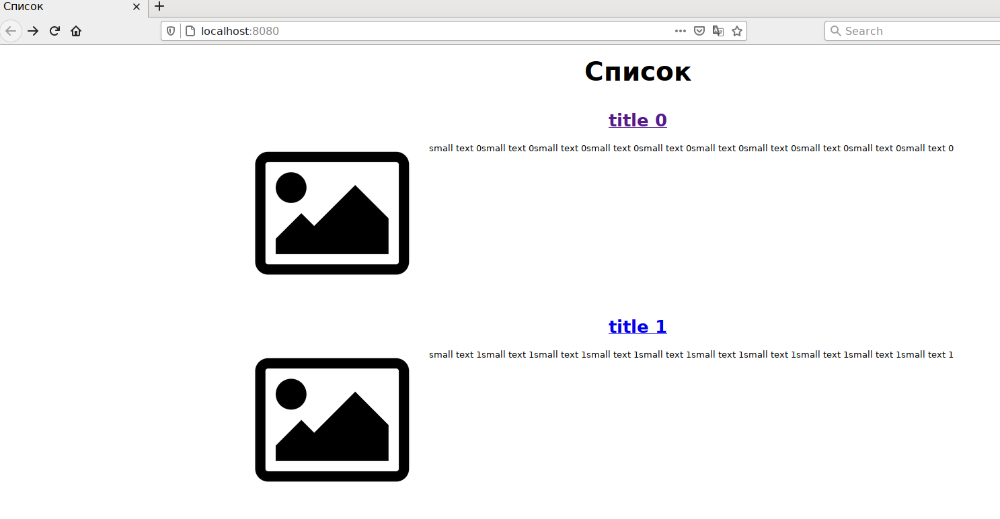
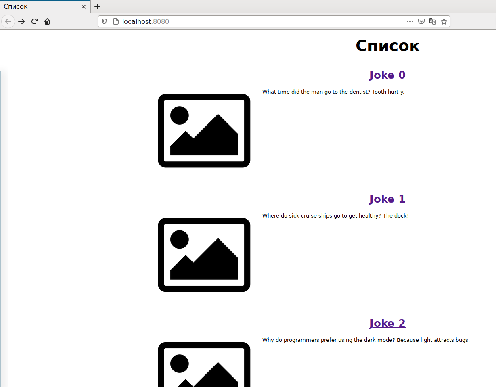

# Домашняя работа по занятию "13.1 контейнеры, поды, deployment, statefulset, services, endpoints"

### `> Why do programmers prefer using the dark mode? Because light attracts bugs.`

---
> Настроив кластер, подготовьте приложение к запуску в нём. Приложение стандартное: бекенд, фронтенд, база данных. Его можно найти в папке 13-kubernetes-config.

Соберём сразу свои образы:
- https://hub.docker.com/r/prividen/some-test-frontend
- https://hub.docker.com/r/prividen/some-test-backend

---
> ## Задание 1: подготовить тестовый конфиг для запуска приложения
> Для начала следует подготовить запуск приложения в stage окружении с простыми настройками. Требования:
> * под содержит в себе 2 контейнера — фронтенд, бекенд;
> * регулируется с помощью deployment фронтенд и бекенд;
> * база данных — через statefulset.

[Манифесты тестового окружения](test-env)

```
$ kubectl get pod,deployment,sts,svc,ep -n 13-01-test
NAME                             READY   STATUS    RESTARTS   AGE
pod/back-front-67bb46bc7-h44p9   2/2     Running   0          25s
pod/postgres-0                   1/1     Running   0          25s

NAME                         READY   UP-TO-DATE   AVAILABLE   AGE
deployment.apps/back-front   1/1     1            1           25s

NAME                        READY   AGE
statefulset.apps/postgres   1/1     25s

NAME                 TYPE        CLUSTER-IP      EXTERNAL-IP   PORT(S)           AGE
service/back-front   ClusterIP   10.233.52.161   <none>        80/TCP,9000/TCP   25s
service/postgres     ClusterIP   10.233.11.83    <none>        5432/TCP          25s

NAME                   ENDPOINTS                             AGE
endpoints/back-front   10.233.105.23:80,10.233.105.23:9000   25s
endpoints/postgres     10.233.126.35:5432                    25s
```

Тестируем:
```
$ kubectl port-forward -n 13-01-test service/back-front 8080:80 9000:9000
```


---
> ## Задание 2: подготовить конфиг для production окружения
> Следующим шагом будет запуск приложения в production окружении. Требования сложнее:
> * каждый компонент (база, бекенд, фронтенд) запускаются в своем поде, регулируются отдельными deployment’ами;
> * для связи используются service (у каждого компонента свой);
> * в окружении фронта прописан адрес сервиса бекенда;
> * в окружении бекенда прописан адрес сервиса базы данных.

> ## Задание 3 (*): добавить endpoint на внешний ресурс api
> Приложению потребовалось внешнее api, и для его использования лучше добавить endpoint в кластер, направленный на это api. Требования:
> * добавлен endpoint до внешнего api (например, геокодер).

Немного [запатчим](https://github.com/Prividen/devkub-homeworks/commit/9bdfee906e52c021c1e36b015380e21b27ee0071) бекэнд для возможности использования внешнего API, 
и соберём [другую версию образа](https://hub.docker.com/layers/prividen/some-test-backend/0.2.2/images/sha256-85096f9872d7bbfc55e2b619618ddca8766f1c2e22b2d17e271dab78a3db4324)

К сожалению, я так и не смог побороть проблему обращения к внешнему API через service/endpoint 
с корректно-работающим HTTPS/SNI (подозреваю, там надо ещё какой-то хитрый ingress готовить, 
но я не знаю как), поэтому выкрутимся, подняв до этого API прокси на соседнем хосте, а туда будем обращаться по http.

[Манифесты prod-окружения](prod-env)

```
$ kubectl get pod,deployment,sts,svc,ep -n 13-01-prod
NAME                         READY   STATUS    RESTARTS   AGE
pod/back-6b58856985-fhx65    1/1     Running   0          12s
pod/front-858fff4cc7-twr6b   1/1     Running   0          12s
pod/postgres-0               1/1     Running   0          12s

NAME                    READY   UP-TO-DATE   AVAILABLE   AGE
deployment.apps/back    1/1     1            1           12s
deployment.apps/front   1/1     1            1           12s

NAME                        READY   AGE
statefulset.apps/postgres   1/1     12s

NAME                  TYPE        CLUSTER-IP      EXTERNAL-IP   PORT(S)    AGE
service/back          ClusterIP   10.233.15.48    <none>        9000/TCP   12s
service/front         ClusterIP   10.233.33.122   <none>        80/TCP     12s
service/joke-server   ClusterIP   10.233.11.92    <none>        80/TCP     12s
service/postgres      ClusterIP   10.233.31.33    <none>        5432/TCP   12s

NAME                    ENDPOINTS            AGE
endpoints/back          10.233.126.36:9000   12s
endpoints/front         10.233.78.24:80      12s
endpoints/joke-server   10.12.41.226:80      12s
endpoints/postgres      10.233.78.23:5432    12s
```

Тестируем, придётся два разных port-forward запускать для разных сервисов:
```
$ kubectl port-forward -n 13-01-prod service/front 8080:80
$ kubectl port-forward -n 13-01-prod service/back 9000:9000
```


Кстати, у фронтэнда проблемы с индивидуальными ссылками, для всех гвоздями прибит адрес самой первой. Но там с этой нодойJS чёрт ногу сломит, не стал фиксить. 